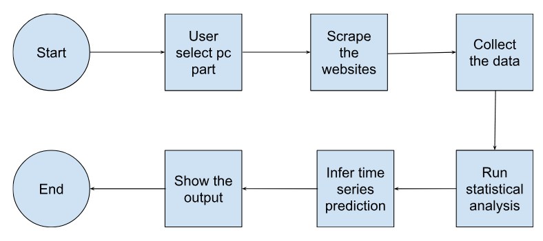

# Final Project Student Hactiv8 Batch FTDS-057-RMT

_Project ini dibuat sebagai bukti kesuksesan pembelajaran student pada Hacktiv8 Full Time Data Science dari fase 0 sampai fase 2._

---

- Anggota Proyek:
  - Didit Aditya
  - Jonathan

---

## Tentang Proyek Akhir

### **DealSense**

DealSense adalah sebuah aplikasi untuk melakukan prediksi harga sebuah komponen komputer berdasarkan harga komponen tersebut dari sebuah kurun waktu tertentu.

---

### Latar Belakang

Terkadang calon pembeli sering kebingungan ketika ingin membeli sebuah produk di toko online atau offline di suatu waktu dan merasa takut bila harga produk tersebut berubah menjadi lebih mahal atau ingin mencari tahu kapan harga komponen tersebut akan menjadi lebih murah beberapa waktu setelah produk komponen tersebut rilis. Ketidak tahuan ini bisa menyebabkan calon pembeli tergiur dengan harga yang terlalu murah dan ternyata barang tersebut tidak memiliki spesifikasi yang dideskripsikan sehingga pembelinya tertipu, atau sebaliknya ketika sebenarnya harga komponen sudah turun namun calon pembeli tersebut akan membelinya di harga tertinggi.

### Tujuan Pembuatan Aplikasi

Harapan kami dengan adanya aplikasi ini adalah calon pembeli komponen komputer bisa merasa terbantu dengan adanya aplikasi ini sehingga para calon pembeli bisa mengetahui harga standar sebuah komponen komputer dan bisa mendapatkan gambaran harga komponen komputer yang dicari setelah melewati kurun waktu yang ditentukan oleh calon pembeli

### Dataset

Dataset yang digunakan adalah mengambil data berupa JSON dari pangoly.com sebagai referensi persentase fluktuasi harga komponen komputer. Sedangkan untuk harga standar lokal adalah web scraping dari beberapa toko online yang menjual komponen komputer tersebut untuk menentukan harga standar secara lokal

**Deskripsi dataset untuk harga lokal:**
| Nama kolom | Tipe Data | Deskripsi | Contoh bentuk data |
| --- | --- | --- | --- |
| Product Name | String | Nama dari produk yang diberikan oleh penjual | Corsair Vengeance ddr5 2x32GB |
| URL | String | Link menuju produk yang dijual di toko online | https://www.hexacom.id/ram-corsair-vengeance-ddr5-64gb-32gbx2-5600mhz-non-rgb-memory-longdimm.html |
| Price IDR | Integer | Harga produk yang dijual di toko online tersebut | 17300000 |

**Deskripsi dataset untuk time series:**
| Nama kolom | Tipe Data | Deskripsi | Contoh bentuk data |
| --- | --- | --- | --- |
| Price USD | Float | Harga rata-rata produk secara global dalam mata uang USD | 118.09 |
| time | UNIX Timestamp | Waktu disaat data harga diambil dalam bentuk UNIX | 1673049600000 |

### Cara Kerja Aplikasi

Pertama, pengguna aplikasi perlu memilih kategori komponen komputer yang ingin dicari harganya. Kemudian aplikasi akan mengambil data fluktuasi harga global untuk komponen komputer yang dicari, lalu persentase fluktuasi tersebut akan diaplikasikan terhadap harga lokal untuk komponen komputer yang dicari. Kemudian aplikasi akan melakukan prediksi harga pada tanggal yang ditentukan oleh pengguna aplikasi berdasarkan nilai fluktuasi tersebut

### Project Output

Aplikasi di-_deploy_ di **Streamlit**

`tes`
